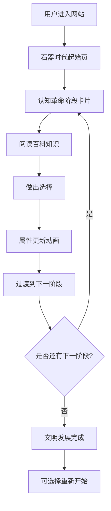

## 1. 产品概述

《人类简史》互动地图是一个基于尤瓦尔·赫拉利著作理念的交互式文明发展模拟网站。用户从"石器时代部落"开始，通过在关键历史节点做出选择，推动人类文明从认知革命一路发展到科学革命时代。

- **核心目的**：以互动游戏化的方式，让用户体验人类文明发展的关键抉择，理解历史进程中的偶然性与必然性
- **目标用户**：历史爱好者、学生、普通大众
- **产品价值**：将抽象的历史知识转化为沉浸式的互动体验，寓教于乐

## 2. 核心功能

### 2.1 用户角色
| 角色 | 注册方式 | 核心权限 |
|------|----------|----------|
| 普通用户 | 无需注册 | 体验文明发展、做出选择、查看历史百科、重新开始文明进程 |

### 2.2 功能模块
1. **首页/互动地图页**：文明时间轴导航、当前文明状态展示、阶段卡片互动
2. **阶段详情模块**：阶段插图展示、百科知识阅读、选择按钮互动
3. **文明状态追踪**：显示当前所处时代、已做选择、文明属性变化
4. **时间轴导航**：可视化展示四个历史阶段的发展进度

### 2.3 页面详情
| 页面名称 | 模块名称 | 功能描述 |
|-----------|-------------|---------------------|
| 互动地图主页 | 头部区域 | 网站标题、文明名称、当前时代显示 |
| 互动地图主页 | 时间轴组件 | 横向滚动的文明时间轴，标记四个阶段，高亮当前阶段 |
| 互动地图主页 | 阶段卡片 | 展示阶段插图、百科知识文本、两个选择按钮 |
| 互动地图主页 | 文明状态面板 | 显示人口、科技、文化、军事等属性值及变化 |
| 互动地图主页 | 选择反馈层 | 选择后的动画过渡、结果说明、进入下一阶段 |

## 3. 核心流程

用户进入网站 → 查看石器时代起始状态 → 阅读认知革命阶段百科 → 做出第一个选择（如"发展语言"或"掌握火"）→ 查看选择带来的文明属性变化 → 动画过渡到农业革命阶段 → 继续做出选择 → 经历帝国阶段 → 到达科学革命阶段 → 完成文明发展历程 → 可选择重新开始。

## 4. 用户界面设计

### 4.1 设计风格
- **设计理念**："古籍新诠"——将历史厚重感与现代交互设计完美融合
- **主色调**：大地色系——赭石色 (#8B4513)、土黄色 (#D2B48C)、深棕色 (#3E2723)，点缀古金色 (#B8860B)
- **辅助色**：石器灰 (#757575)、农业绿 (#558B2F)、帝国紫 (#4A148C)、科技蓝 (#0D47A1)
- **背景**：仿羊皮纸纹理，带有做旧边缘效果
- **按钮风格**：浮雕质感，圆角矩形，hover时有凹陷效果和金色光晕
- **字体**：
  - 标题：古典衬线字体 "Playfair Display" 或 "Source Han Serif"，庄重典雅
  - 正文：现代人文无衬线 "Noto Sans SC"，保证可读性
- **布局**：不对称卡片式布局，配合羊皮纸卷轴元素，营造翻开历史长卷的感觉
- **图标**：使用线性图标配合做旧纹理，风格统一

### 4.2 页面设计概述
| 页面名称 | 模块名称 | UI 元素 |
|-----------|-------------|----------|
| 互动地图主页 | 头部区域 | 大标题采用花体装饰文字，两侧有古典分隔线装饰，背景渐变融入羊皮纸纹理 |
| 互动地图主页 | 时间轴组件 | 横向蜿蜒的古路线条，四个节点采用不同时代风格的徽章设计，节点间有连接线动画 |
| 互动地图主页 | 阶段卡片 | 大尺寸卡片，上半部分是历史场景插图，下半部分是卷轴式文本区域，选择按钮仿古代印章/令牌风格 |
| 互动地图主页 | 文明状态面板 | 仿古代度量衡样式的仪表盘，数值变化时有动态刻度动画 |
| 互动地图主页 | 选择反馈层 | 全屏过渡动画，带有粒子效果和时代色彩渲染，模拟文明演进的视觉冲击 |

### 4.3 响应式设计
- 采用桌面优先设计，适配 1280px 及以上屏幕
- 平板端：时间轴改为垂直布局，卡片宽度自适应
- 移动端：单列布局，插图缩小，文字行距优化，触摸区域增大
- 所有交互元素确保最小 44x44px 触摸区域

### 4.4 动效设计
- 页面加载：卷轴展开动画，内容从上到下逐步呈现
- 阶段切换：翻页过渡效果，旧页面如羊皮卷收起，新页面展开
- 选择按钮：hover时有微微上浮和金色边框发光，点击时有印章按下的凹陷效果
- 数值变化：属性值增加时数字滚动并伴有绿色向上箭头，减少时红色向下箭头
- 时间轴：节点激活时发出柔和光晕，连接线从已完成节点向当前节点延伸动画
