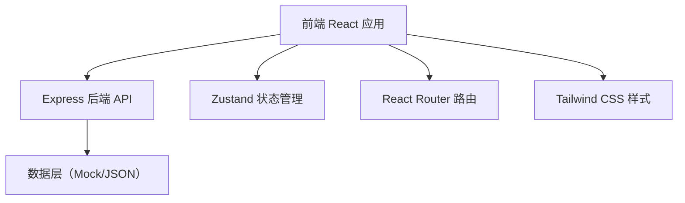
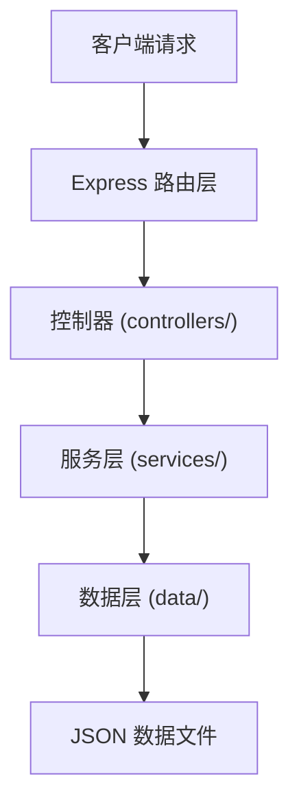
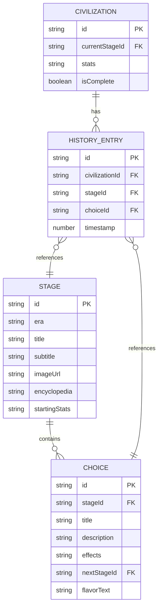

## 1. 架构设计



## 2. 技术描述

- **前端**：React 18 + TypeScript + Tailwind CSS 3 + Vite
- **状态管理**：Zustand
- **路由**：React Router DOM v6
- **图标**：Lucide React
- **后端**：Express 4 + TypeScript
- **数据**：JSON 静态数据（模拟历史阶段和选择数据）
- **初始化工具**：vite-init
- **项目模板**：react-express-ts（全栈模板）

## 3. 路由定义

| 路由 | 用途 |
|-------|---------|
| / | 互动地图主页，展示完整的文明时间轴和阶段卡片 |
| /stage/:stageId | 特定阶段详情页（可直接访问） |

## 4. API 定义

### 4.1 类型定义

```typescript
// 文明属性类型
interface CivilizationStats {
  population: number;      // 人口
  technology: number;      // 科技
  culture: number;         // 文化
  military: number;        // 军事
  agriculture: number;     // 农业
}

// 选择项类型
interface Choice {
  id: string;
  title: string;
  description: string;
  effects: Partial<CivilizationStats>;
  nextStageId: string;
  flavorText: string;      // 选择后的叙事文本
}

// 阶段类型
interface Stage {
  id: string;
  era: string;             // 时代名称
  title: string;           // 阶段标题
  subtitle: string;        // 副标题/时间范围
  imageUrl: string;        // 阶段插图URL
  encyclopedia: string;    // 百科知识文本
  choices: Choice[];       // 两个选择项
  startingStats: Partial<CivilizationStats>; // 该阶段起始属性调整
}

// 文明状态类型
interface CivilizationState {
  currentStageId: string;
  stats: CivilizationStats;
  history: Array<{
    stageId: string;
    choiceId: string;
    timestamp: number;
  }>;
  isComplete: boolean;
}

// API 响应类型
interface ApiResponse<T> {
  success: boolean;
  data?: T;
  error?: string;
}
```

### 4.2 API 端点

| 方法 | 路径 | 描述 | 请求 | 响应 |
|------|------|------|------|------|
| GET | /api/stages | 获取所有阶段列表 | 无 | ApiResponse<Stage[]> |
| GET | /api/stages/:id | 获取单个阶段详情 | 无 | ApiResponse<Stage> |
| POST | /api/choice | 提交选择，计算结果 | { stageId, choiceId, currentStats } | ApiResponse<{ nextStage: Stage \| null, newStats: CivilizationStats, flavorText: string }> |
| GET | /api/civilization/reset | 重置文明状态 | 无 | ApiResponse<{ currentStage: Stage, initialStats: CivilizationStats }> |

## 5. 服务器架构



## 6. 数据模型

### 6.1 实体关系图



### 6.2 项目目录结构

```
.
├── src/                    # 前端源代码
│   ├── components/         # React 组件
│   │   ├── Timeline.tsx    # 文明时间轴组件
│   │   ├── StageCard.tsx   # 阶段卡片组件
│   │   ├── StatsPanel.tsx  # 文明状态面板
│   │   ├── ChoiceButton.tsx # 选择按钮组件
│   │   └── TransitionOverlay.tsx # 过渡动画层
│   ├── pages/              # 页面组件
│   │   └── Home.tsx        # 首页/互动地图
│   ├── store/              # Zustand 状态管理
│   │   └── useCivilizationStore.ts
│   ├── types/              # TypeScript 类型定义
│   │   └── index.ts
│   ├── utils/              # 工具函数
│   │   └── api.ts          # API 调用封装
│   ├── App.tsx
│   ├── main.tsx
│   └── index.css
├── api/                    # 后端源代码
│   ├── controllers/        # 控制器
│   │   ├── stagesController.ts
│   │   └── civilizationController.ts
│   ├── services/           # 业务逻辑
│   │   ├── stagesService.ts
│   │   └── civilizationService.ts
│   ├── data/               # 数据层
│   │   └── stages.json     # 阶段数据
│   ├── types/              # 后端类型
│   └── index.ts            # Express 入口
├── shared/                 # 前后端共享类型
│   └── types.ts
├── vite.config.ts
├── tailwind.config.js
├── tsconfig.json
└── package.json
```
